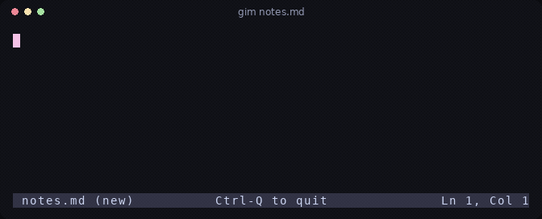

# gim

grok vim — a small no-modes terminal editor with emacs/macOS keybinds.

Notes are auto-saved. Every window on the same file shares one editor.



```
gim                  # opens your default notes file
gim notes.md         # opens a specific file
gim --local [FILE]   # edit in this process only, no daemon
gim --kill [FILE]    # save and stop the daemon for a file
```

The default notes file is `$GIM_NOTES`, else `$XDG_DATA_HOME/gim/notes.md`, else `~/.local/share/gim/notes.md`. Daemon sockets and logs live under `$XDG_STATE_HOME/gim/run/` (else `~/.local/state/gim/run/`).

## Features

- Cross-pane. Every window on the same file shares one editor.
- Notes stay saved. Autosave, and the daemon keeps the session after the window closes.
- Terminal-native. Familiar emacs/readline and macOS text-field keybinds.
- No modes. Soft wrap, mouse selection, one file at a time.

## Install

```
cargo install --path .
```

Requires a stable Rust toolchain (1.89 or newer).

## Keys

Keybinds follow emacs/readline and macOS text-field conventions, inspired by the prompt in [xai-org/grok-build](https://github.com/xai-org/grok-build), which I helped create and maintain.

| Keys | Action |
|---|---|
| Left / Right, Ctrl-B / Ctrl-F | Move by one character |
| Option-Left / Right, Ctrl-Left / Right, Option-b / Option-f | Move by word |
| Ctrl-A / Ctrl-E | Line start / end; again to reach the previous / next line |
| Home / End | Line start / end |
| Up / Down, Ctrl-P / Ctrl-N | Move by visual row, keeping the column |
| PageUp / PageDown | Move by one screen |
| Ctrl-Home / Ctrl-End, Cmd-Up / Cmd-Down | Start / end of the file |
| Shift + any motion | Extend the selection |
| Cmd-A, Option-a | Select all |
| Esc | Clear the selection or the status message |
| Enter | Insert a newline (always) |
| Tab | Insert a tab (shown four columns wide) |
| Backspace / Delete, Ctrl-H / Ctrl-D | Delete one character |
| Option-Backspace, Ctrl-Backspace | Delete the word before the cursor |
| Option-Delete, Option-d | Delete the word after the cursor |
| Ctrl-W | Delete back to the previous space |
| Ctrl-U / Ctrl-K | Delete to the line start / end; at the edge, join the lines |
| Ctrl-Y | Reinsert the last deleted word or line |
| Ctrl-Z, Cmd-Z | Undo |
| Ctrl-Shift-Z, Cmd-Shift-Z, Option-z, Ctrl-R | Redo |
| Ctrl-C, Cmd-C | Copy the selection (without one: does nothing, never quits) |
| Ctrl-X, Cmd-X | Cut the selection |
| Ctrl-V, Cmd-V | Paste |
| Ctrl-S, Cmd-S | Save now (saving is automatic; this just reports it) |
| Ctrl-Q | Save and close this window |
| Ctrl-L | Scroll the cursor row to the middle |

Saving is automatic: the file is written one second after you stop typing and again when you quit. The status line shows `[+]` while a change is not yet on disk.

Mouse: click to place the cursor, drag to select, double-click a word, triple-click a line, wheel to scroll without moving the cursor. Selecting never copies; press Ctrl-C to copy what is selected.

Daemon, files, terminal quirks, and limitations: [docs](docs/README.md).
